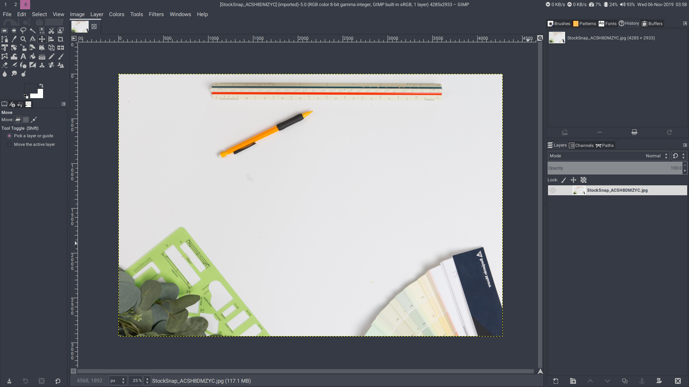

# Requirements
Supported WMs

|WM|Ubuntu|Arch Linux|Gentoo|Void|
|-|-|-|-|-|
|i3-gaps|-*|i3-gaps|i3-gaps|i3-gaps|
|bspwm|bspwm|bspwm|bspwm|bspwm|

\* Must be built from source

|Program|Ubuntu|Arch Linux|Gentoo|Void|Explanation|
|-|-|-|-|-|-|
|Compton|compton|compton|compton|compton|Compositor for shadow & fading|
|Dunst|dunst|dunst|dunst|dunst|Notification daemon (for displaying notifications)
|hsetroot|hsetroot|hsetroot|hsetroot|polybar|Set workspace background color|
|Polybar|-*|polybar**|polybar|polybar|Bar|
|Rofi|rofi|rofi|rofi|rofi|Launcher|
|xrdb|x11-xserver-utils|xorg-xrdb|xrdb|xrdb|For loading .Xresources|

\* Must be built from source\
\*\* Package available on AUR

**Fonts**

Icon Font

|Font|Ubuntu|Arch Linux|Gentoo|Void|
|-|-|-|-|-|
|Font Awesome 5|fonts-font-awesome|ttf-font-awesome|fontawesome|font-awesome5|

Default Fonts

|Font|Ubuntu|Arch Linux|Gentoo|Void|
|-|-|-|-|-|
|Roboto|fonts-roboto|ttf-roboto|roboto|fonts-roboto-ttf|
|Noto Sans CJK|fonts-noto-cjk|noto-fonts-cjk|noto-cjk|noto-fonts-cjk|
|Source Code Pro|-*|adobe-source-code-pro-fonts|source-pro|font-adobe-source-code-pro|

\* Must be downloaded and copied to font directory

**Optional**

scrot (for screenshots)

# Installation
Copy .minoflat directory, .Xresources and .Xresources.d directory to your home directory (~) and some configurations in .config to ~/.config or you can copy all files in this directory to your home directory

# Preview
\
Programs: qutebrowser, st, neofetch & cmus\
WM: i3-gaps

Program: GIMP\
WM: bspwm


# Scripts

```~/.minoflat/scripts/tiling-common``` init script for i3 & bspwm and as a workaround for passing .Xresources value to hsetroot\
```convert_xresources``` To convert .Xresources to Minoflat's format (see convert_xresources -h for information)

# Credits
Default color scheme: Relaxed by Michael Kühnel https://github.com/Relaxed-Theme/relaxed-terminal-themes \
Picture edited with GIMP by Kristin Hardwick https://stocksnap.io/photo/ACSH8DMZYC
