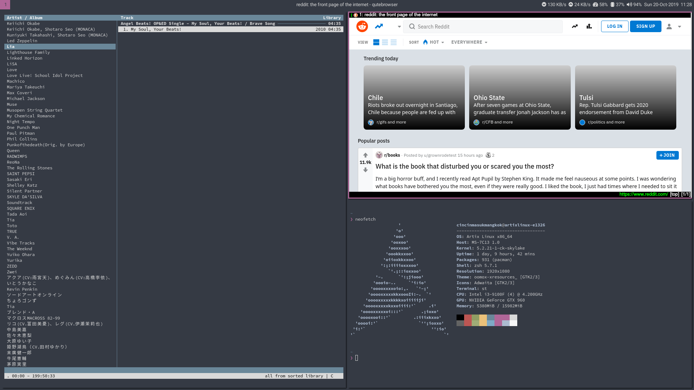
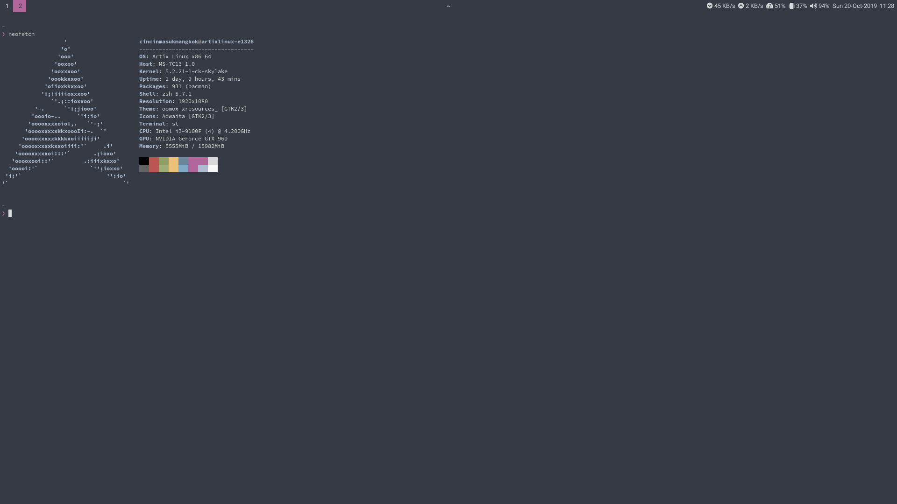

# Requirements
Supported WMs

|WM|Ubuntu|Arch Linux|Gentoo|
|-|-|-|-|-|
|i3-gaps|-*|i3-gaps|i3-gaps|
|bspwm|bspwm|bspwm|bspwm|
\* Must be build from source

|Program|Ubuntu|Arch Linux|Gentoo|Explanation|
|-|-|-|-|-|
|Compton|compton|compton|compton|Compositor for shadow & fading|
|Dunst|dunst|dunst|dunst|Notification daemon (for displaying notifications)
|hsetroot|hsetroot|hsetroot|hsetroot|Set workspace background color|
|Polybar|-*|polybar**|polybar|Bar|
|Rofi|rofi|rofi|rofi|Launcher|
|xrdb|x11-xserver-utils|xorg-xrdb|xrdb|For loading .Xresources|

\* Must be build from source\
\*\* Package available on AUR

**Fonts**

Icon Font

|Font|Ubuntu|Arch Linux|Gentoo|
|-|-|-|-|
|Font Awesome 5|fonts-font-awesome|ttf-font-awesome|fontawesome|

Default Fonts

|Font|Ubuntu|Arch Linux|Gentoo|
|-|-|-|-|
|Roboto|fonts-roboto|ttf-roboto|roboto|
|Noto Sans CJK|fonts-noto-cjk|noto-fonts-cjk|noto-cjk|
|Source Code Pro|-*|adobe-source-code-pro-fonts|source-pro|

\* Must be downloaded and copied to font directory

**Optional**

scrot (for screenshots)

# Installation
Copy .minoflat directory, .Xresources and .Xresources.d directory to your home directory (~) and some configurations in .config to ~/.config

# Preview
\
Programs: qutebrowser, st, neofetch & cmus


Programs: st & neofetch

# Scripts

```~/.minoflat/scripts/tiling-common``` init script for i3 & bspwm and as a workaround for passing .Xresources value to hsetroot\
```convert_xresources``` To convert .Xresources to Minoflat format

# Credits
Default color scheme: Relaxed by Michael Kühnel https://github.com/Relaxed-Theme/relaxed-terminal-themes
