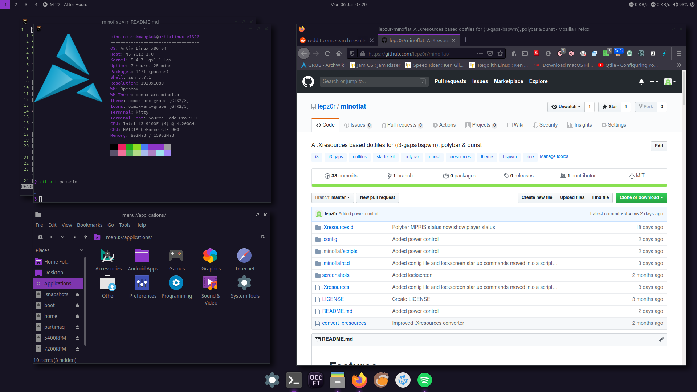
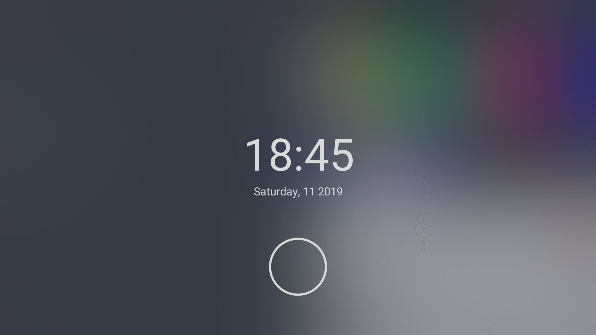

# Features
* .Xresources theming
* Media control with media keys or keyboard shortcut
* Power control
* Auto reload .Xresources & restart bar if reloaded

# Requirements
Supported WMs

|WM|Debian|Arch|Fedora|Gentoo|Void|
|-|-|-|-|-|-|
|i3-gaps|-*|i3-gaps|-*|i3-gaps|i3-gaps|
|bspwm|bspwm|bspwm|bspwm|bspwm|bspwm|
|openbox|openbox|openbox|openbox|openbox|openbox|

\* Must be built from source

**Programs**

|Program|Debian/Ubuntu|Arch|Fedora|Gentoo|Void|Explanation|
|-|-|-|-|-|-|-|
|Compton4|compton|- (replaced by Picom)|compton|compton|- (replaced by Picom)|Compositor for shadow & fading.|
|Picom4|-1|picom|picom|picom|picom|Compositor for shadow & fading.|
|Dunst|dunst|dunst|dunst|dunst|dunst|Notification daemon (for displaying notifications).|
|hsetroot|hsetroot|hsetroot|-1|hsetroot|polybar|Set workspace background color.|
|Polybar|-1/PPA (https://launchpad.net/~kgilmer/+archive/ubuntu/speed-ricer, (polybar))5|polybar2|-1|polybar|polybar|Bar.|
|Rofi|rofi|rofi|rofi|rofi|rofi|Launcher.|
|xrdb|x11-xserver-utils|xorg-xrdb|xorg-x11-server-utils|xrdb|xrdb|For loading .Xresources.|
|xautolock|xautolock|xautolock|xautolock|xautolock|xautolock|For auto locking.|
|playerctl|playerctl|playerctl|playerctl|playerctl|playerctl|MPRIS (music) support.|
|i3lock-color|-1|i3lock-color|-1|i3lock-color3|i3lock-color|Lockscreen.|
|scrot|scrot|scrot|scrot|scrot|scrot|For taking screenshot.|
|ImageMagick|imagemagick|imagemagick|ImageMagick|imagemagick|ImageMagick|For blurring the screenshot for the lockscreen.|
|plank|plank|plank|plank|plank3|plank|For stacking wm's dock.|
|oomox|deb (https://github.com/themix-project/oomox/releases)|oomox2|-1|-1|-1|Generate a GTK theme to match the color scheme.|

1 Must be built from the source.\
2 Package available on AUR.\
3 Search on https://gpo.zugaina.org/ to find overlay that have the package.\
4 Install only one of both.\
5 PPA only available for Ubuntu / deriveratives.

**Fonts**

Icon Font

|Font|Debian|Arch|Fedora|Gentoo|Void|
|-|-|-|-|-|-|
|Font Awesome 5|-*|ttf-font-awesome|-*|fontawesome|font-awesome5|

Default Fonts

|Font|Debian|Arch|Fedora|Gentoo|Void|
|-|-|-|-|-|-|
|Roboto|fonts-roboto|ttf-roboto|google-roboto-fonts|roboto|fonts-roboto-ttf|
|Noto Sans CJK|fonts-noto-cjk|noto-fonts-cjk|google-noto-sans-cjk-*-fonts|noto-cjk|noto-fonts-cjk|
|Source Code Pro|-*/PPA (https://launchpad.net/~kgilmer/+archive/ubuntu/regolith-stable, fonts-source-code-pro-ttf)2|adobe-source-code-pro-fonts|adobe-source-code-pro-fonts|source-pro|font-adobe-source-code-pro|

1 Must be downloaded and copied to font directory.\
2 PPA only available for Ubuntu / deriveratives.

# Installation
Copy `.minoflat` directory, `.Xresources` `.Xresources.d` and `minoflatrc.d` directory to your home directory (`~`) and some configurations in `.config` to `~/.config` or you can copy all files in this directory to your home directory.

# Configuration
You can change the configuration in `~/.config/minoflat/config`.
* `accent-color` : Change accent color.
* `opacity` : Change opacity for some element (currently for rofi only).
* `terminal-tiling` : Change tiling WM's terminal.
* `terminal-stacking` : Change stacking WM's terminal.
* `session-manager` : Change session manager to use, supported : `logind` and `consolekit`, anything else or unconfigured will use sudo for power management, systemd & elogind users should use `logind`, setting up this incorrectly may disable power management.

# User scripts
`~/.minoflatrc.before` and every scripts in `~./minoflatrc.before.d` will be executed before minoflat's init script.\
`~/.minoflatrc` and every scripts in `~/.minoflatrc.d` will be executed after minoflat's init script.

# Helper Scripts
|Script|Description|
|-|-|
|generate-config|Generate a config for programs that don't support .Xresources"

# Shortcuts
This will work with all supported wms, media control can also be controlled with media keys, all WM use their default bindings.\
\
Music :
* Super+F5 : Previous track.
* Super+F7 : Next track.
* Super+F6 : Play/Pause track.

Volume :
* Super+F9 : Volume down.
* Super+F11 : Volume up.
* Super+F10 : Mute/Unmute.

Super+shift+S (i3), Super+alt+S (bspwm) : Open System Menu. \
Super+R (openbox) : Open Launcher (rofi).

\* Super keys is Windows key on PC keyboards or Command key on Mac keyboards.

# Preview
\
Programs: qutebrowser, st, neofetch & cmus\
WM: i3-gaps
Color Scheme: Relaxed

Program: GIMP\
WM: bspwm
Color Scheme: Relaxed

Program: Firefox PCManFM, neofetch, Firefox, Spotify, vim\
WM: openbox
Color Scheme: Grape by zdj

Lockscreen
Color Scheme: Relaxed

# Credits
Default color scheme: Relaxed by Michael Kühnel https://github.com/Relaxed-Theme/relaxed-terminal-themes \
Picture edited with GIMP by Kristin Hardwick https://stocksnap.io/photo/ACSH8DMZYC \
Grape color scheme by zdj https://github.com/zdj/themes
